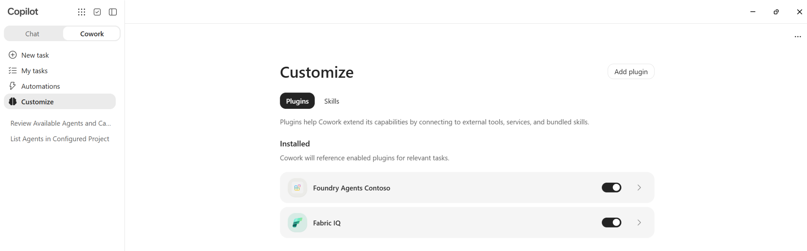
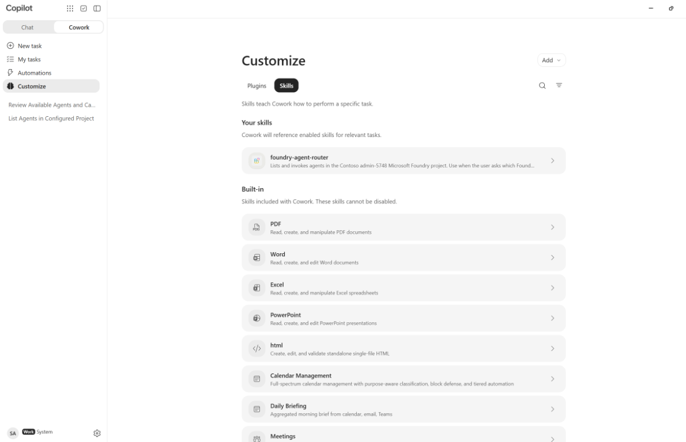
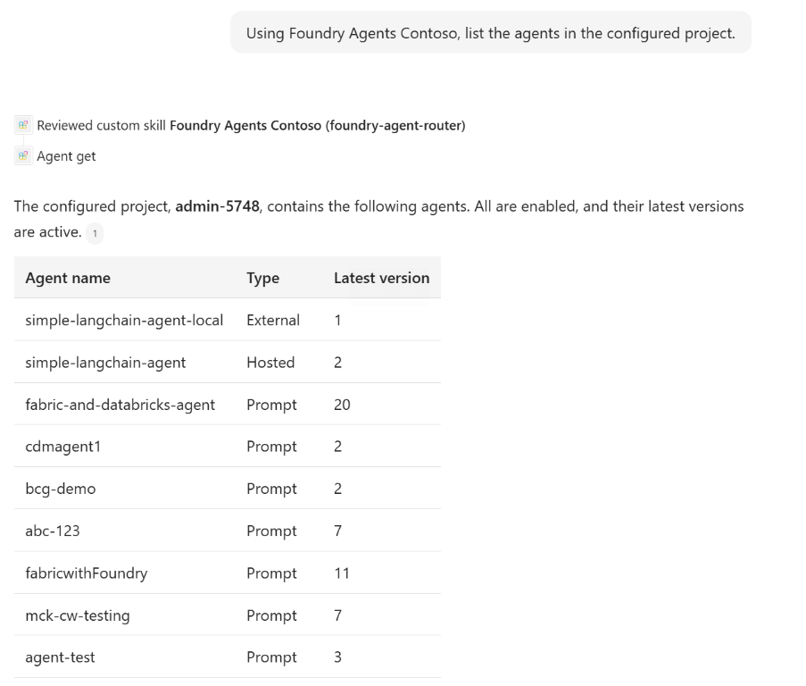

# Foundry agents in Microsoft 365 Copilot Cowork

A reusable, same-tenant Cowork plugin sample for listing and invoking Microsoft
Foundry agents through Microsoft's hosted MCP server. No custom proxy or hosted
application code is required for this connection.

**Bring your own tenant, registrations, project, and publisher metadata.** This
repository contains templates, not a preauthorized plugin. A generated ZIP is
bound to your environment and should not be published as a generic release.

The folder can be renamed or cloned as its own repository; its original folder
name is not a configuration dependency. This is a community sample, not an
official Microsoft product or a guarantee of availability in every tenant.

## Contents

- [Architecture and access boundaries](#architecture-and-access-boundaries)
- [Prerequisites](#prerequisites)
- [Same-tenant setup](#same-tenant-setup)
- [Visual walkthrough](#visual-walkthrough)
- [Testing conversation and tools](#testing-conversation-and-tools)
- [Troubleshooting](#troubleshooting)
- [Operations and public sharing](#operations-and-public-sharing)
- [Files and references](#files-and-references)

## Architecture and access boundaries

```text
Cowork user
  -> plugin + routing skill
  -> Microsoft 365 OAuth vault
     -> tenant-owned Entra Web client
     -> authorization code + PKCE + client secret
  -> https://mcp.ai.azure.com
     -> agent_get / agent_invoke
     -> your Foundry project and selected agent
        -> the agent's configured tools
```

The package uses a unified app manifest with `agentConnectors`,
`OAuthPluginVault`, static tool descriptions, and a routing skill. The Foundry
connection resource ID is **not** the OAuth reference or runtime URL. The
connector calls the hosted MCP URL and supplies the project endpoint as a tool
argument.

This is delegated OAuth, not registration-free SSO. An existing browser session
can streamline sign-in, but the registrations and consent are still required.

| Boundary | What it controls |
|---|---|
| OAuth consent | Whether the client may request `Foundry.Mcp.Tools` for the user |
| Azure RBAC | The signed-in user's access to Foundry resources and operations |
| Tool descriptions and skill | Guidance toward the configured project and tools |
| Agent-internal tools | Access through the agent's own configured identities |

The client secret authenticates the client; it does not give users the setup
administrator's privileges. Entra admin roles and Azure resource roles are
distinct. Global Administrator is not required for routine agent invocation.

**Static tool descriptions are not a security allowlist.** The hosted server
offers additional tools that may be discovered dynamically. The delegated
`Foundry.Mcp.Tools` scope is broader than "invoke only"; an endpoint enum or skill
instruction is not server-side authorization. Use least-privilege Azure RBAC.
If strict tool/project/agent restrictions are required, enforce them with an
appropriate server-side layer, such as a restricted MCP proxy.

## Prerequisites

- Access to Cowork and permission to upload custom plugins in the target tenant.
  Availability, UI, and policies can vary.
- A Foundry project and an invocable agent in that same tenant.
- Appropriate Azure RBAC for each intended user.
- Permission to create Entra apps/service principals and grant the required
  consent under your organization's policies.
- PowerShell **7.2+** (`pwsh`), Azure CLI, and Microsoft 365 Agents Toolkit CLI.
  Packaging and local tests need only PowerShell; registration and platform
  validation use the Toolkit.
- Your own publisher name, website, privacy policy, and terms URLs.

The build targets **Azure public-cloud** project endpoints shaped like
`https://{resource}.services.ai.azure.com/api/projects/{project}`. Sovereign
clouds, custom endpoints, and cross-tenant deployment are not covered.

## Same-tenant setup

Run commands from this repository's root using PowerShell 7. Do not run setup
commands against a parent directory containing unrelated projects.

### 1. Check every sign-in context

The Cowork user, Foundry project, Entra client, and OAuth vault registration
should be in the intended tenant.

```powershell
az account show --query '{tenant:tenantId,subscription:id,user:user.name}'
$env:ATK_CLI_SKILL = 'true'
atk auth list -i false
```

If needed:

```powershell
$tenantId = Read-Host 'Target Entra tenant ID'
az login --tenant $tenantId
atk auth login m365 --tenant $tenantId -i false
```

Azure CLI, Toolkit, VS Code's Azure account, Developer Portal, and Cowork can
all use different accounts. Check the active organization in each.

### 2. Create the Entra OAuth client

In **Entra ID > App registrations > New registration**:

1. Choose a name and **Accounts in this organizational directory only**.
2. Register this **Web** redirect URI:
   `https://teams.microsoft.com/api/platform/v1.0/oAuthRedirect`.
3. Record the Application (client) ID and Directory (tenant) ID.
4. Leave implicit access-token and ID-token grants disabled.
5. Verify that the client's enterprise application/service principal exists.
   CLI-based app creation may require explicitly creating its service principal.

Use your own app as the client. The Microsoft-owned Foundry MCP resource app
ID, `fcdfa2de-b65b-4b54-9a1c-81c8a18282d9`, is a shared service identifier,
**not** your OAuth client ID.

### 3. Create a client credential

In the client's **Certificates & secrets**, create a secret with an expiry
allowed by policy. Securely capture the **Value**, not the Secret ID. Record an
owner and rotation deadline.

Do not put the secret in configuration files, Git, documentation, or the ZIP.
The provisioning example below reads it interactively into the process
environment and removes it afterward. Use your approved credential-management
process on shared machines.

### 4. Configure the permission and consent

Add the delegated permission
`https://mcp.ai.azure.com/Foundry.Mcp.Tools` to the client.

If the resource is missing from **API permissions > APIs my organization uses**,
inspect the tenant-local resource service principal:

```powershell
az ad sp show --id fcdfa2de-b65b-4b54-9a1c-81c8a18282d9 `
  --query '{id:id,appId:appId,scopes:oauth2PermissionScopes}'
```

Only if absent, an authorized administrator can create it:

```powershell
az ad sp create --id fcdfa2de-b65b-4b54-9a1c-81c8a18282d9 `
  --query '{id:id,appId:appId,scopes:oauth2PermissionScopes}'
```

Confirm the returned `Foundry.Mcp.Tools` scope is enabled; use its returned ID
when configuring permissions through Graph or CLI. Creating the service
principal does not grant consent. A missing permission-picker entry is not
proof that consent is prohibited.

Choose the consent audience deliberately:

- **User-specific:** user consent where policy permits, or an authorized
  administrator's Graph `oauth2PermissionGrant` with `consentType: Principal`
  and the intended user's object ID.
- **Tenant-wide:** **Grant admin consent** or `AllPrincipals` only when required
  for the approved rollout.

For Graph grants, `clientId` is the client's **service principal object ID**,
`resourceId` is the resource's **service principal object ID**, and
`principalId` is the user's object ID for `Principal` consent. The scope string
is `Foundry.Mcp.Tools`. Read back the grant to verify its audience and scope.
Assign least-privilege Foundry Azure roles separately.

### 5. Configure the project and register the Microsoft 365 OAuth client

Copy the example only when creating a new configuration; do not overwrite an
existing environment:

```powershell
if (Test-Path .\env\.env.dev) { throw 'Existing configuration: edit it instead.' }
Copy-Item .\env\.env.example .\env\.env.dev
```

Fill the following keys in your local environment file. Use plain, unquoted
`KEY=value` lines; do not use inline comments or variable interpolation.

| Key | Value |
|---|---|
| `TEAMS_APP_TENANT_ID` | Target tenant's GUID |
| `FOUNDRY_OAUTH_CLIENT_ID` | Your Entra client's Application ID |
| `FOUNDRY_PROJECT_ENDPOINT` | Project endpoint from Foundry settings, no trailing slash |
| `APP_DISPLAY_NAME` | Your plugin name, up to 30 characters |
| `DEVELOPER_NAME` | Your publisher name, up to 32 characters |
| `DEVELOPER_WEBSITE_URL` | Your HTTPS website |
| `DEVELOPER_PRIVACY_URL` | Your HTTPS privacy policy |
| `DEVELOPER_TERMS_URL` | Your HTTPS terms |
| `TEAMS_APP_ID` | Leave blank for first provisioning; Toolkit writes the generated ID |
| `FOUNDRY_OAUTH_REFERENCE_ID` | Leave blank for first provisioning; Toolkit writes the full vault reference |

Use publisher URLs on a consistent domain; platform validation checks the
website, privacy, and terms relationship. Do not distribute a package containing
example publisher metadata.

The [provisioning configuration](./m365agents.yml) runs `teamsApp/create`, then
`oauth/register`. It **does not create** the Entra client, service principals,
credential, consent, or Azure RBAC.

```powershell
$env:ATK_CLI_SKILL = 'true'
try {
    $env:SECRET_FOUNDRY_OAUTH_CLIENT_SECRET = Read-Host 'Client secret Value' -MaskInput
    if ([string]::IsNullOrWhiteSpace($env:SECRET_FOUNDRY_OAUTH_CLIENT_SECRET)) {
        throw 'A client secret is required.'
    }
    atk provision --env dev -f . -i false
    if ($LASTEXITCODE -ne 0) { throw 'Provisioning failed; inspect Toolkit diagnostics.' }
} finally {
    Remove-Item Env:\SECRET_FOUNDRY_OAUTH_CLIENT_SECRET -ErrorAction SilentlyContinue
}
```

The vault and Entra app registration are separate objects. These are the vault
settings used by the sample:

| Setting | Value |
|---|---|
| Flow / identity provider | `authorizationCode` / `Custom` |
| Base URL | `https://mcp.ai.azure.com` |
| Authorization URL | `https://login.microsoftonline.com/{tenant-id}/oauth2/v2.0/authorize` |
| Token / refresh URL | `https://login.microsoftonline.com/{tenant-id}/oauth2/v2.0/token` |
| Scope | `https://mcp.ai.azure.com/Foundry.Mcp.Tools offline_access` |
| App / organization restrictions | `AnyApp` / `HomeTenant` |
| PKCE | `true` |
| Token exchange | `PostRequestBody` |

`Custom` means standard OAuth in this Toolkit configuration; the issuer is
still Entra. This is not the Toolkit's separate SSO mode. PKCE and a client
secret can be used together for a confidential Web client.

For manual administration, use **OAuth client registration** in
[Developer Portal](https://dev.teams.microsoft.com/tools), under the same
account and organization. Do not create a duplicate if Toolkit has already
created the record. If managing registrations manually, supply the Microsoft
365 app ID and full auth config ID in the environment file.

Keep the full generated OAuth registration reference unchanged. It is not the
Entra client ID, Teams app ID, or Foundry connection ID. Do not decode or shorten
it when using it as `OAuthPluginVault`'s reference.

**Existing registrations:** `oauth/register` skips creation when its output ID
is already populated. To change settings or rotate a secret, use the Toolkit's
`oauth/update` lifecycle action or the portal as appropriate. Rebuilding the ZIP
does not update the vault; do not clear IDs just to force duplicate registrations.

### 6. Build and validate

The source manifest and tool descriptions contain intentionally empty
environment-bound fields. The routing skill contains a project-endpoint marker.
**Do not upload or manually zip the templates.** The build fills them from your
local configuration without modifying the source files.

```powershell
pwsh -NoProfile -File .\build.ps1
pwsh -NoProfile -File .\tests\build.tests.ps1
```

The default output is `dist\Foundry-Agents-Cowork-v1.0.0.zip`; the version comes
from the [manifest template](./coworkPlugin/manifest.json). Rebuilding replaces
the same version's ZIP. Bump its version before distributing an updated plugin.

Optional explicit paths:

```powershell
pwsh -NoProfile -File .\build.ps1 -EnvironmentFile .\env\.env.dev -OutputDirectory .\dist
```

The archive has exactly these five files, with **no wrapper directory**:

```text
manifest.json
foundry-agent-tools.json
color.png
outline.png
skills/foundry-agent-router/SKILL.md
```

Local tests use synthetic registrations, check configuration failures, validate
rendering/escaping and package contents, and build a standalone copy without
parent-folder dependencies. They do not authenticate or provision anything.

Run platform package validation against your generated ZIP:

```powershell
$packageFile = Read-Host 'Absolute path to your generated ZIP'
$env:ATK_CLI_SKILL = 'true'
atk validate --package-file $packageFile --validate-method validation-rules -i false
if ($LASTEXITCODE -ne 0) { throw 'Package validation failed.' }
```

Neither local tests nor platform package validation prove OAuth, consent, RBAC,
or agent behavior. Do the live checks below in your own environment.

### 7. Upload and test

1. In Cowork, open **Customize > Plugins > Upload plugin**.
2. Upload your generated ZIP, enable the plugin, and connect.
3. Sign in as the intended user in the correct tenant.
4. Start a **new Cowork task** and confirm that it selects your current plugin
   and routing skill, not an older similarly named package.
5. List agents, select a returned name, and request a harmless invocation.
6. Inspect the actual connector call, not just the natural-language response.

Send these prompts separately:

> Using the configured Foundry connector, list the available agents.

> Invoke the selected agent to briefly describe its capabilities. Do not take
> external actions.

Repeat with a restricted test user. Unauthorized operations should fail rather
than falling back to an administrator or another identity.

## Visual walkthrough

These original screenshots show a demonstration environment and are included
with the owner's approval. The displayed tenant, plugin, project, agent names,
and unrelated UI content are **illustrative, not configuration values**. Your
available agents and UI may differ. Screenshots are not evidence that every
listed agent or advanced capability was tested.

### Enable the plugin

Under **Customize > Plugins**, confirm the uploaded Foundry plugin is enabled.
Other visible plugins are not prerequisites.



### Check the routing skill

Locate the packaged `foundry-agent-router` skill. Its presence alone does not
verify authentication or conversation-state reuse.



### List agents through the connector

The example shows skill selection, an **Agent get** call, and the returned list.



## Testing conversation and tools

Basic OAuth connection, agent listing, and invocation succeeded in the original
same-tenant demonstration. The reusable packaging refactor still needs live
verification in each destination tenant. Multi-turn persistence, restricted-user
behavior, agent-internal tools, and audio are **not established by that demo**.

Use synthetic data and read-only tools:

| Test | Evidence to collect |
|---|---|
| Follow-up context | Ask to remember a test code, then change another detail; inspect actual inputs and returned IDs |
| Ordered invocations | Ask for an answer, critique, then revision; verify distinct ordered calls |
| Agent-internal tool | Inspect Foundry traces for the actual downstream tool execution |
| New-task isolation | A new Cowork task must not unintentionally inherit previous task state |
| Restricted user | Expected allowed operations succeed; denied operations fail without identity fallback |
| Dictation | If the app exposes this connector, verify transcription and an actual tool call |

Correct recall alone does not prove native Foundry memory: Cowork can resend a
summary. MCP transport sessions, prompt-agent `conversationId`, hosted-agent
`sessionId`, and Cowork task history are different. Reuse identifiers only for
the same user, task, project, and agent. The skill falls back to a concise
context summary when no reusable identifier is returned.

This connector accepts **text**, not raw audio. App dictation, when available,
is distinct from an audio-capable agent integration.

## Troubleshooting

| Symptom | Check |
|---|---|
| Connects but wrong project/skill is used | Disable old or duplicate plugins, upload the intended ZIP, and start a fresh task |
| OAuth registration not visible | Check Developer Portal's account and organization independently of Azure CLI |
| `AADSTS65003` | Check for a first-party token-to-self flow; use a separate tenant-owned client |
| `AADSTS700016` | Check client ID, authority tenant, and application/service-principal availability |
| `invalid_client` | Inspect full Entra error, secret Value/expiry, Web client type, authorities, and token exchange settings |
| Missing consent | Verify resource scope and the grant for this user or tenant |
| Foundry access denied | Check signed-in identity and Azure RBAC at the relevant scope |
| Provisioning doesn't update OAuth | Use `oauth/update`; `oauth/register` skips existing output IDs |
| Build reports missing setting | Fill all required keys in the local environment; templates are intentionally blank |
| Package rejected | Use the build script; verify schema, references, icon sizes, and no wrapper folder |

Do not infer a root cause from a generic error, repeatedly rotate credentials,
or switch to an SPA client without evidence. For escalation collect timestamps,
correlation/request IDs, tenant/client IDs, and full error codes from authorized
diagnostics. Never publish tokens or secrets.

## Operations and public sharing

- Assign client/vault owners and rotate secrets in both Entra and the vault
  before expiry.
- Review delegated grants, Azure RBAC, and downstream agent-tool identities.
- Retest sign-in, invocation, and task isolation after material changes.
- Publish the **source sample**, not your configured environment or generated ZIP.
- The [ignore rules](./.gitignore) exclude environment files, local backups,
  generated ZIPs, and build output. The blank example is intentionally included.
- Git ignore rules do not remove files already committed. Review staged files
  and history before any public push; rotate credentials if ever exposed.
- Review screenshots before redistributing them. Replace them if your
  organization's disclosure policy requires different visuals.

If this folder is inside another repository, initialize a dedicated repository
here (or copy only the publishable files to a clean folder) before staging.
Never publish a broader parent workspace by mistake.

From the intended standalone repository root:

```powershell
git rev-parse --show-toplevel
git status --short --untracked-files=all
git add --dry-run .
```

Confirm the root and candidate files before using `git add`. This sample does
not create a remote, commit, or publish anything automatically.

Code and documentation are provided under the [MIT license](./LICENSE).
Microsoft product names, logos, and depicted UI remain the property of their
respective owners; this sample conveys no trademark rights or endorsement.

## Files and references

| File | Purpose |
|---|---|
| [Environment example](./env/.env.example) | Blank tenant-specific configuration |
| [Provisioning](./m365agents.yml) | Microsoft 365 app and OAuth vault registration |
| [Build script](./build.ps1) | Configuration validation and isolated ZIP generation |
| [Build tests](./tests/build.tests.ps1) | Dependency-free local packaging tests |
| [Manifest](./coworkPlugin/manifest.json) | Unified app manifest template |
| [Tool descriptions](./coworkPlugin/foundry-agent-tools.json) | Listing and invocation schemas |
| [Routing skill](./coworkPlugin/skills/foundry-agent-router/SKILL.md) | Tool-selection and follow-up instructions |
| [Screenshots](./docs/images) | Embedded visual walkthrough |

Authoritative references:

- [Microsoft 365 Agents Toolkit](https://learn.microsoft.com/microsoftteams/platform/toolkit/agents-toolkit-fundamentals)
- [Microsoft Teams app manifest schema](https://learn.microsoft.com/microsoftteams/platform/resources/schema/manifest-schema)
- [Entra authorization-code flow](https://learn.microsoft.com/entra/identity-platform/v2-oauth2-auth-code-flow)
- [Delegated permission grants](https://learn.microsoft.com/graph/api/resources/oauth2permissiongrant)
- [Foundry role-based access control](https://learn.microsoft.com/azure/ai-foundry/concepts/rbac-azure-ai-foundry)
- [Microsoft 365 Developer Portal](https://dev.teams.microsoft.com/tools)
